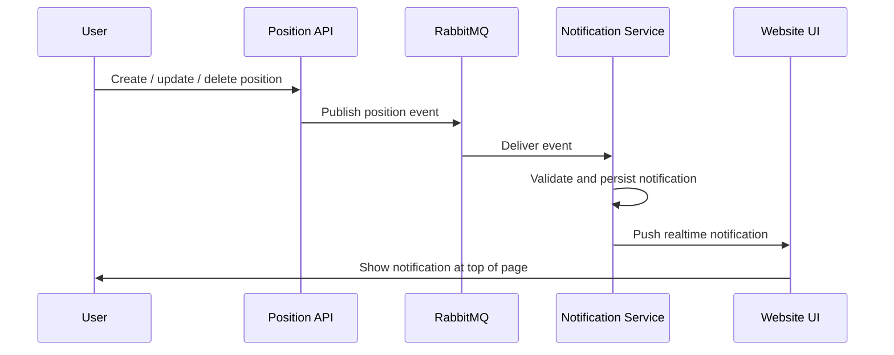

# Software Requirements Specification: Position Change Notification System

## 1. Purpose

This document defines the requirements for the overall notification system that publishes and displays real-time alerts whenever a position is created, updated, or deleted in the organizational hierarchy application.

The current NestJS backend remains the source of truth for position management. A separate notification microservice will consume position events through RabbitMQ and push notifications to a single-page website so they appear at the top of the page in a notification area.

## 2. Scope

The system will:

- Detect position create, update, and delete actions.
- Publish those actions as domain events to RabbitMQ.
- Consume the events in a notification microservice.
- Persist notification records for audit and replay.
- Deliver live notifications to the frontend in near real time.
- Show notifications in a top-of-page notification panel controlled by a notification button.

The system will not replace the existing position CRUD API. It will extend it with event-driven notification capabilities.

## 3. Goals

- Inform users immediately when organizational structure changes.
- Keep notification delivery decoupled from the position management API.
- Support reliable delivery using RabbitMQ.
- Allow the frontend to load unread and recent notifications.
- Provide a design that can later support other event types beyond positions.

## 4. Current System Context

The existing backend is a NestJS API with position CRUD operations already implemented. Relevant behaviors include:

- `POST /api/positions` creates a position.
- `PUT /api/positions/:id` updates a position.
- `DELETE /api/positions/:id` removes a position.
- The app uses TypeORM and PostgreSQL.
- Swagger is already available for API documentation.

This SRS adds an event-driven notification layer on top of the current system.

## 5. Proposed Architecture

### 5.1 High-Level Components

- Position API: existing NestJS backend that performs create, update, and delete operations.
- RabbitMQ broker: message bus for publishing and consuming position change events.
- Notification Service: separate NestJS microservice that consumes events, stores notification data, and broadcasts updates.
- Notification Store: notification tables or schema stored in the existing application database.
- Web Client: single-page website frontend that displays top-of-page notifications and marks items as read.

### 5.2 Communication Flow

1. A user creates, updates, or deletes a position in the main API.
2. The API publishes a position event to RabbitMQ.
3. The notification service consumes the message.
4. The notification service saves the notification and emits a real-time update to connected clients.
5. The frontend receives the update and shows it at the top of the page.

## 6. Integration Design

### 6.1 Event Types

The system shall publish the following events:

- `position.created`
- `position.updated`
- `position.deleted`

### 6.2 Event Payload

Each message shall include at least:

- event type
- event id
- entity type
- position id
- position name
- action timestamp
- actor identifier if available
- old values for update and delete events when needed
- new values for create and update events when needed

Example payload:

```json
{
  "eventType": "position.updated",
  "eventId": "uuid",
  "entityType": "position",
  "positionId": "uuid",
  "positionName": "Product Owner",
  "actorId": "uuid",
  "occurredAt": "2026-07-02T10:15:00Z",
  "changes": {
    "name": { "before": "Product Manager", "after": "Product Owner" }
  }
}
```

### 6.3 RabbitMQ Topology

Recommended topology:

- Exchange: `organization.events`.
- Exchange type: topic.
- Routing keys: `position.created`, `position.updated`, `position.deleted`.
- Queue: `notification.position.events`.
- Dead-letter queue: `notification.position.events.dlq`.

### 6.4 Delivery Rules

- Publish events only after the position transaction completes successfully.
- Use message acknowledgements in the consumer.
- Retry transient failures.
- Move poison messages to the dead-letter queue after retry exhaustion.
- Use idempotency keys so duplicate deliveries do not create duplicate notifications.

### 6.5 API-to-Notification Service Contract

The current NestJS API shall publish events to RabbitMQ after successful position mutations.

The notification service shall subscribe to the following routing keys:

- `position.created`
- `position.updated`
- `position.deleted`

The current API shall not call the notification service directly. RabbitMQ is the only integration path between the systems.

The current API shall include the following event fields:

- event id
- event type
- entity type
- position id
- position name
- position snapshot
- change snapshot for update events
- timestamp

Recommended exchange name:

- `organization.events`

Recommended queue name for the consumer side:

- `notification.position.events`

Recommended dead-letter queue name:

- `notification.position.events.dlq`

## 7. Notification Service Requirements

### 7.1 Functional Requirements

FR-1: The service shall consume position events from RabbitMQ.

FR-2: The service shall validate message structure before processing.

FR-3: The service shall transform each event into a user-facing notification.

FR-4: The service shall persist notifications in a database.

FR-5: The service shall expose an API to fetch unread and recent notifications without requiring a separate notification authorization flow.

FR-6: The service shall support marking notifications as read.

FR-7: The service shall push new notifications to connected web clients in real time.

FR-8: The service shall support notification filtering by user or role when needed.

### 7.2 Non-Functional Requirements

NFR-1: Notifications should appear within 2 seconds under normal operating conditions.

NFR-2: The system shall tolerate temporary RabbitMQ outages through retries and persistence.

NFR-3: The design shall avoid tight coupling between the position API and the notification service.

NFR-4: The notification service shall be horizontally scalable.

NFR-5: The system shall log all event processing failures.

NFR-6: The system shall protect message integrity and avoid duplicate notifications.

## 8. Frontend Requirements

### 8.1 Notification Display

The website shall be a single-page application with a notification button fixed in the top area.

The notification button shall open a top-of-page notification panel or dropdown.

### 8.2 Frontend Behavior

- Show new notifications without requiring a page refresh.
- Display the notification title, message, timestamp, and severity.
- Allow users to open a notification and navigate to the related position detail.
- Allow users to dismiss or mark notifications as read.
- Show an unread count badge.

### 8.3 Client Connection

The frontend shall receive live updates from the notification service using Server-Sent Events.

The frontend may use standard HTTP requests to mark notifications as read.

## 9. API Requirements for Notification Service

Suggested endpoints:

- `GET /notifications`
- `GET /notifications/unread`
- `POST /notifications/:id/read`
- `POST /notifications/read-all`
- `GET /notifications/stream` for SSE

Suggested realtime channel:

- SSE endpoint such as `notifications/stream`.

### 9.1 Notification Service Endpoints

The notification service should expose:

- `GET /notifications`
- `GET /notifications/unread`
- `GET /notifications/stream`
- `POST /notifications/:id/read`
- `POST /notifications/read-all`
- `GET /health`

### 9.2 Position Event Endpoints in the Main API

The existing hierarchy system already exposes the mutation endpoints that generate notifications:

- `POST /api/positions`
- `PUT /api/positions/:id`
- `DELETE /api/positions/:id`
- `GET /api/positions`
- `GET /api/positions/tree`
- `GET /api/positions/:id`
- `GET /api/positions/:id/children`

Only the first three endpoints must publish RabbitMQ events.

## 10. Data Model

### 10.1 Notification Entity

Suggested fields:

- id
- eventId
- eventType
- title
- message
- entityType
- entityId
- severity
- status
- createdAt
- readAt
- recipientId or recipientGroup if needed
- metadata JSON

### 10.2 Status Values

- unread
- read
- archived

## 11. User Stories

### 11.1 Administrator

- As an administrator, I want to see a notification when a position is created so that I know the structure changed.
- As an administrator, I want to see a notification when a position is updated so that I can review changes immediately.
- As an administrator, I want to see a notification when a position is deleted so that I can verify the hierarchy impact.

### 11.2 Regular User

- As a user, I want notifications to appear at the top of the website so I do not miss important changes.
- As a user, I want to mark notifications as read so I can manage what I have already seen.

## 12. Business Rules

- BR-1: A position create, update, or delete action must produce at least one notification event.
- BR-2: A notification must only be published after the main transaction succeeds.
- BR-3: Deleting a position with children should still emit a failure or blocked-action notification if the application needs audit visibility.
- BR-4: Duplicate messages must not generate duplicate notifications.
- BR-5: Notification display order shall be newest first.

## 13. Sequence of Operation



## 14. Security Requirements

- The RabbitMQ broker shall require authenticated connections.
- The notification API shall not require a separate authorization layer for this use case.
- Message payloads shall avoid exposing secrets or raw credentials.
- Only authorized roles shall be allowed to publish position events.

## 14.1 Configuration Requirements

The current API shall support at least the following environment variables:

- `RABBITMQ_URL`
- `RABBITMQ_EXCHANGE`
- `RABBITMQ_ROUTING_PREFIX`

The notification service should use the same RabbitMQ exchange and routing keys to consume events.

## 15. Reliability and Error Handling

- Failed messages shall be retried with backoff.
- Messages that repeatedly fail shall move to a dead-letter queue.
- The notification service shall store processing status for traceability.
- The system shall expose health checks for the API, the notification service, and RabbitMQ connectivity.

## 16. Observability

The implementation should include:

- structured application logs
- event trace identifiers
- consumer lag monitoring
- queue depth monitoring
- notification delivery metrics

## 17. Acceptance Criteria

The solution is accepted when:

- creating a position generates a notification event
- updating a position generates a notification event
- deleting a position generates a notification event
- RabbitMQ successfully transfers events to the notification service
- the frontend shows notifications at the top of the page
- unread notifications can be fetched and marked as read
- duplicate deliveries do not create duplicate notifications

## 18. Implementation Notes

Recommended stack for the new microservice:

- NestJS for the notification service
- RabbitMQ for messaging
- The existing PostgreSQL database for notification storage
- Server-Sent Events for live delivery
- Swagger for notification service API documentation

Recommended phases:

1. Add domain events to the existing position API.
2. Stand up RabbitMQ and define exchange and queues.
3. Build the notification microservice consumer.
4. Persist notification records and expose REST endpoints.
5. Add realtime UI delivery on the website.
6. Add tests, metrics, and dead-letter handling.

## 19. Out of Scope

- Email, SMS, and push notification channels.
- User preference management for notification categories.
- Historical analytics dashboards.
- Cross-organization notification federation.

## 20. Open Questions

The following decisions are confirmed for this SRS:

- Notifications are delivered in a single-page website with a top notification button.
- No separate authorization flow is required for notification access in this version.
- Server-Sent Events is the realtime transport.
- The notification service uses the same PostgreSQL database as the existing application.

